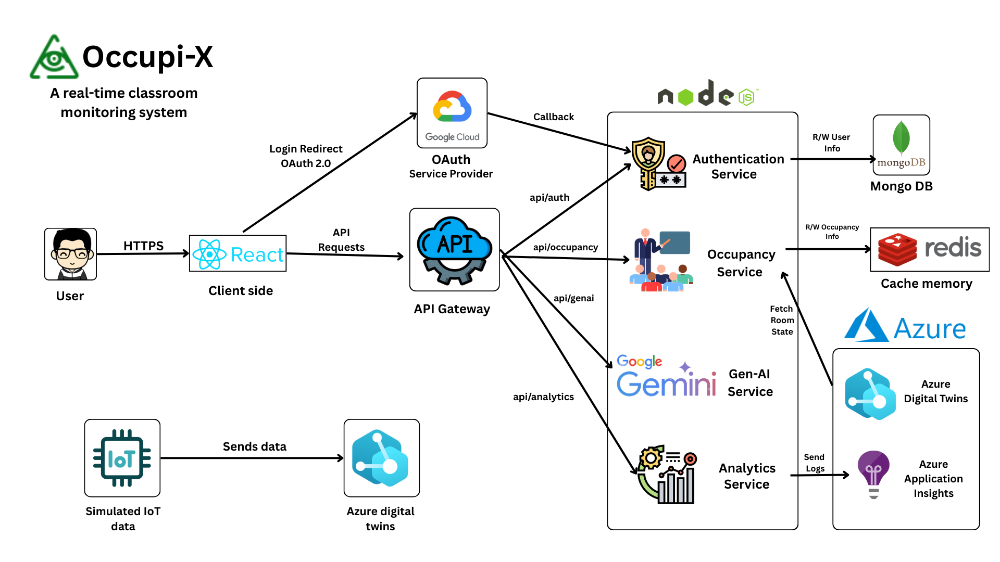
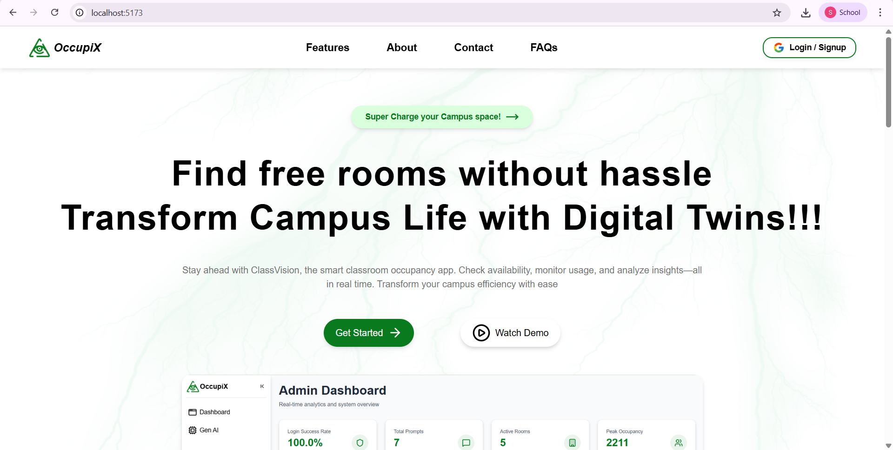
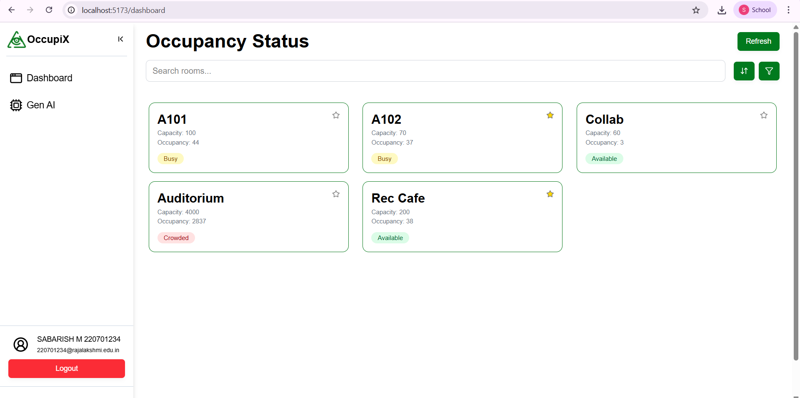
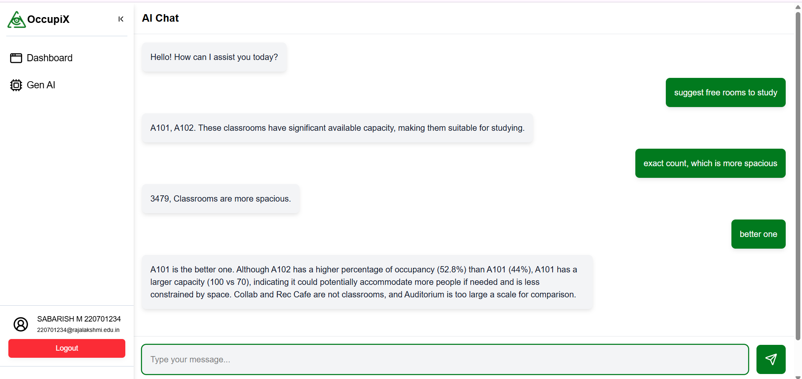
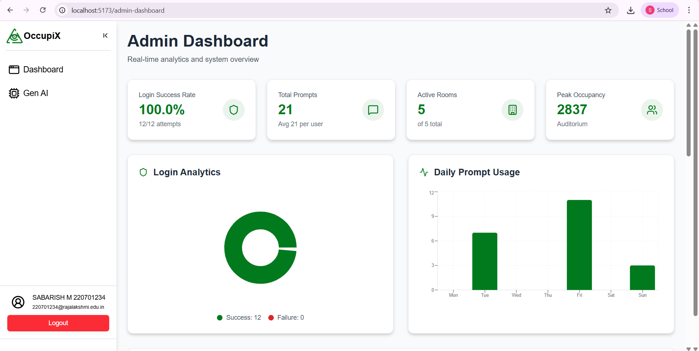

# 📊 Real-Time Classroom Occupancy Monitoring App

A MERN-stack application to monitor classroom occupancy in real-time using **Azure Digital Twins** and **Azure Application Insights**.  
Since physical IoT sensors are not available, the project **simulates sensor data** and demonstrates **cloud integration, authentication, GenAI, responsive frontend, and modern web security practices**.  

---

## 📐 System Architecture

## 🚀 Features
- 🔹 **Real-Time Occupancy Simulation** – Generates random occupancy values for classrooms.  
- 🔹 **Azure Digital Twins Integration** – Models classrooms and tracks live occupancy.  
- 🔹 **Application Insights Telemetry & Logging** –  
  - Logs system events (errors, warnings, info)  
  - Monitors failed/successful login attempts  
  - Provides **admin dashboards** for activity monitoring 
- 🔹 **Authentication & Security**  
  - Google OAuth 2.0 for secure login  
  - JWT-based authentication with **distributed key system (JWKS)**  
  - Tokens sent via **secure HTTP-only cookies**  
  - **Rate limiting** to prevent abuse  
  - Input validation and secure headers  
- 🔹 **Role-Based Access** – Different dashboards for students, faculty, and admins.   
- 🔹 **Responsive Frontend** – Mobile-friendly UI with TailwindCSS + Shadcn/UI.  
- 🔹 **GenAI Service** – Uses **Google Gemini model** to generate intelligent insights (e.g., usage summaries, recommendations).  
- 🔹 **Multi-Service Setup** – Independent Node.js services running on different ports (Auth, Simulation, GenAI, API Gateway, Frontend).  

---

## 🛠️ Tech Stack
- **Frontend:** React (Vite, TailwindCSS, Shadcn/UI)  
- **Backend Services:** Node.js, Express  
- **Database:** MongoDB  
- **Cloud Services:** Azure Digital Twins, Azure Application Insights  
- **GenAI Service:** Google Gemini API  

---

📸 **Screenshots:**  

### Landing Page

### Dashboard Page

### Gen-AI Page

### Admin Page-1

### Admin Page-2

---

## 🎯 Learning Goals
- Understand how **Azure Digital Twins** can represent physical spaces.  
- Implement **secure authentication** (OAuth + JWT + cookies) in a distributed system.  
- Learn **real-time monitoring & logging** using Application Insights.  
- Build **protected routes & responsive UI** in React.  
- Use **GenAI (Google Gemini)** for intelligent reporting.  
- Practice **multi-service architecture** using different Node.js services.  

---

## 📚 Future Improvements
- Replace simulated data with **real IoT sensors**.  
- Add **WebSockets for instant occupancy updates**.  
- Extend GenAI service for **predictive analytics** (e.g., peak usage times).  
- Add **detailed admin dashboards** for logs and telemetry insights.  

---

## 👨‍💻 Author
- **[Sabarish M]** – College Project for Cloud + Security + GenAI with MERN  

